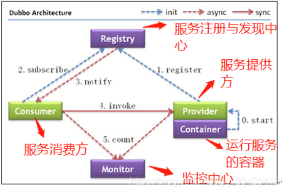

# 什么是Dubbo?

高性能、轻量级、开源的Java RPC分布式服务框架。

- 面向接口的远程方法调用

- 智能容错和负载均衡

- 服务自动注册和发现 

```
  RPC：远程过程调用。它是一种通过网络从远程计算机程序上请求服务，而不需要了解底层网络技术的协议。
```

# Dubbo的服务治理



- Provider 服务提供者
- Consumer 服务消费者
- Container 服务运行容器
- Registry 服务这侧与发现中心
- Monitor 监控中心

## 调用关系说明:

1. 服务容器启动
2. 服务提供者向注册中心注册自己提供的服务
3. 服务消费者向注册中心订阅自己所需要的服务
4. 注册中心返回服务提供者的地址列表给消费者，如有改变， 则推送变更数据给消费者
5. 服务消费者，基于软负载均衡算法，选一台提供者进行调用，如果失败，则再选一台调用
6. 服务消费者和服务提供者定时每分钟发送一次统计数据到监控中心


